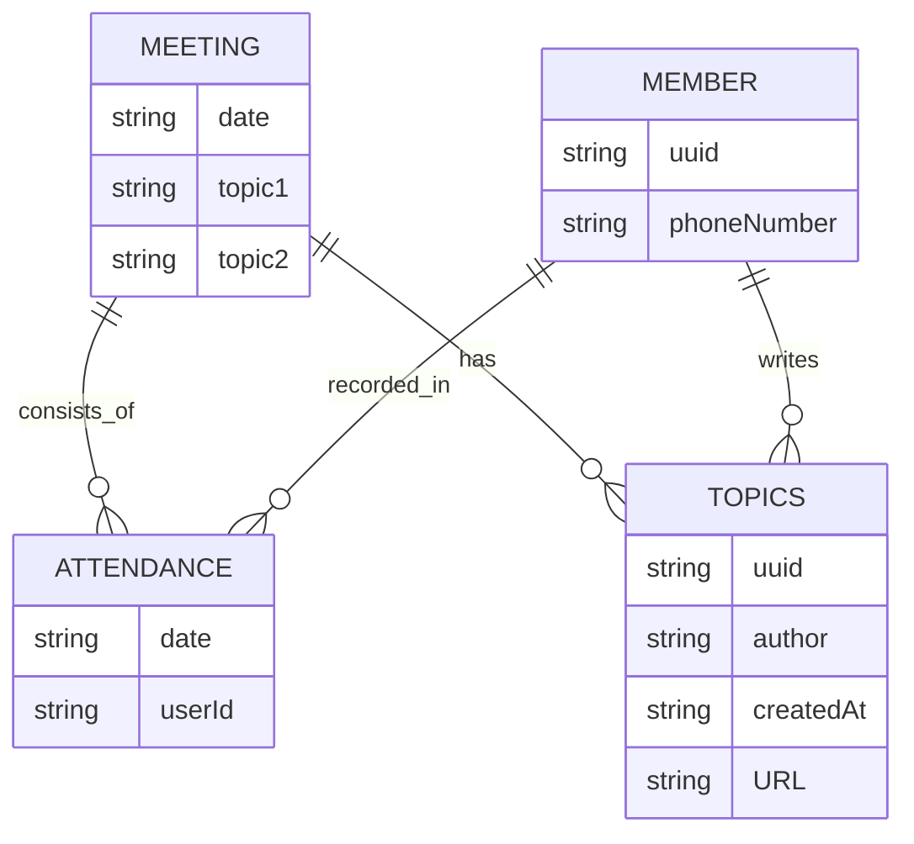

# How to Run

To run locally, use Docker Compose.

```shell
docker compose up
```

# Designing Concerns

## Database

The application have four main entities: `Meetings`, `Members`, `Attendance Records` (attendance), and `Topics`.

An attendance represents the presence of a member at a meeting. An attendance record is a unique pair of a member ID and
meeting ID. A single meeting can have multiple attendances if multiple members attend the meeting. Similarly, a single
member can have multiple attendances from attending multiple meetings.

| Attendance ID | Meeting ID         | Member ID |
|---------------|--------------------|-----------|
| Attendance#1  | Meeting#2024-03-23 | Member#1  |
| Attendance#2  | Meeting#2024-03-23 | Member#2  |
| Attendance#3  | Meeting#2024-03-23 | Member#3  |
| Attendance#4  | Meeting#2024-03-30 | Member#2  |
| Attendance#5  | Meeting#2024-03-30 | Member#3  |

A topic is authored by a member. Each topic has a unique ID, a title, and a URL. Each meeting consumes 2 topics. A topic
once consumed in a meeting cannot be used for another meeting.

| Topic ID | Author (Member ID) | Title  | URL   |
|----------|--------------------|--------|-------|
| Topic#1  | Member#1           | Hello  | URL#1 |
| Topic#2  | Member#3           | World! | URL#2 |

The relationships among
these entities are illustrated below:


