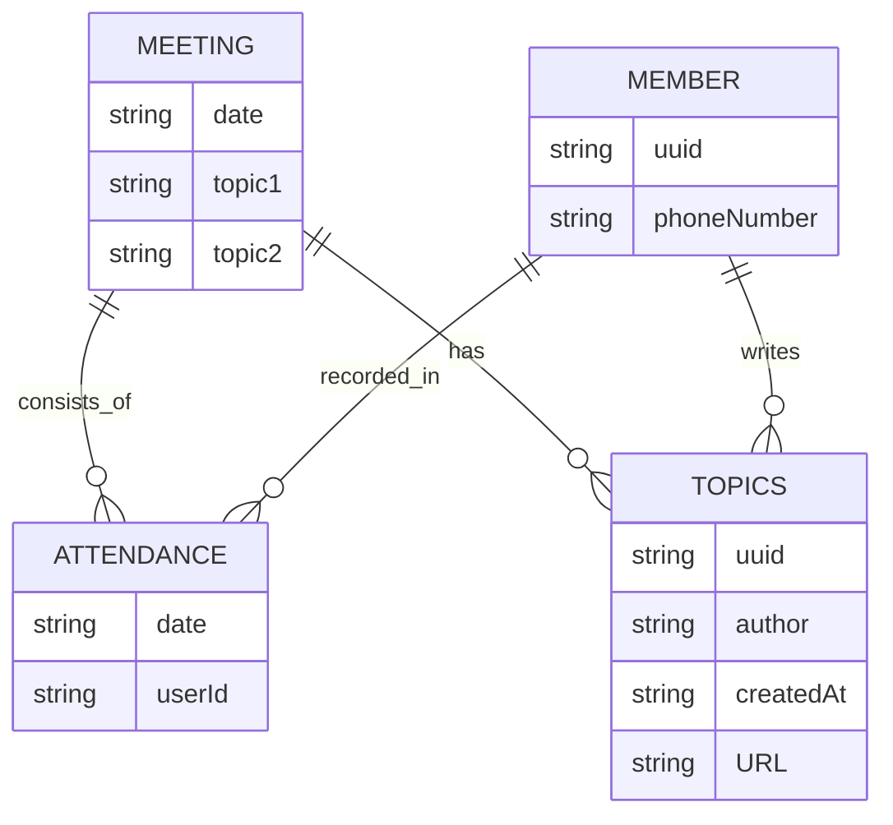

# How to Run

To run locally, use Docker Compose.

```shell
docker compose up
```

# How to Deploy

## Prerequisites

1. AWS CLI
2. Docker

## Steps

1. Create CloudFormation stack with `infra/cloudformation.yaml` by a preferred option.
    1. [CLI](https://docs.aws.amazon.com/AWSCloudFormation/latest/UserGuide/using-cfn-cli-creating-stack.html)
    2. [Console](https://docs.aws.amazon.com/AWSCloudFormation/latest/UserGuide/cfn-console-create-stack.html)
    3. [Git sync](https://docs.aws.amazon.com/AWSCloudFormation/latest/UserGuide/git-sync.html)
2. ECR Repository
   1. If a repository is already created, input its URI into the parameter when specifying stack details.
   2. If there is no repository, leave ECRRepositoryURI part blank. It will create a new repository. While the stack is
      in creation, wait for the ECr resource to be created. Then, push image to the repository to continue stack
      creation. [Pushing a Docker image](https://docs.aws.amazon.com/AmazonECR/latest/userguide/docker-push-ecr-image.html)
3. ACM Certificate
   1. Cognito Custom Domain requires ACM. During the stack creation, validation email will be sent to the account owner.
      It must be approved to continue the stack creation.
4. CodeStar Connection
   1. CloudFormation will only create a `pending` status connection.
   2. Visit AWS console > Developer Tools > Connections > created connection > update pending connection > connect to
      GitHub
   3. If no GitHub app is previously installed, install a new one.

# Tech Stacks

| Name          | Category | Note |
|---------------|----------|------|
| Web Framework | NestJS   |      |
| ORM           | TypeORM  |      |
|               |          |      |

# Designing Concerns

## NestJS

List of NestJS techniques used in the project.

<details>
<summary>Configuration Service</summary>

1. Custom Config Files
2. Configuration Namespaces and Partial Registration

NestJS ConfigModule supports the management of complex and nested configuration files through "namespaced" configuration
objects, using the `registerAs()` function. This method improves clarity and facilitates the handling of intricate
configuration setups.

Consider the following TypeScript code where databaseConfig is created as a namespaced configuration object:

```TypeScript
import { registerAs } from '@nestjs/config'
import * as process from 'process'

export default registerAs('database', () => ({
	host: process.env.DB_HOST || 'database',
	port: +process.env.DB_PORT || 5432,
	database: process.env.DB_NAME || 'postgres',
	username: process.env.DB_USERNAME || 'postgres',
	password: process.env.DB_PASSWORD || 'postgres',
}))
```

```TypeScript
@Module({
	imports: [ConfigModule.forRoot({
		load: [databaseConfig],
	}),
		TypeOrmModule.forRootAsync({
			imports: [ConfigModule.forFeature(databaseConfig)],
			inject: [databaseConfig.KEY],
			useFactory: async (databaseConfiguration: ConfigType<typeof databaseConfig>) => ({
				type: 'postgres',
				host: databaseConfiguration.host,
				port: databaseConfiguration.port,
				username: databaseConfiguration.username,
				password: databaseConfiguration.password,
				database: databaseConfiguration.database,
				entities: ['dist/**/*.entity.js'],
				synchronize: true,
				namingStrategy: new SnakeNamingStrategy(),
			}),
		})],
	controllers: [AppController],
	providers: [AppService],
})
export class AppModule {
}
```

Here, the forRoot method of the ConfigModule loads the configuration. Then, the forRootAsync and forFeature functions in
the TypeOrmModule and ConfigModule, respectively, are used for asynchronous method handling while injecting the defined
configuration. The databaseConfig.KEY constant, provided by registerAs(), gives access to the entire 'database'
configuration object. It is worth noting that the useFactory method receives a strongly-typed ConfigType representing
the databaseConfig.

This approach provides partial registration of configuration, enhancing modularization by associating each dedicated
configuration file with its specific feature module. Relatability between configuration and their specific feature
modules is thereby enforced—facilitating improved readability, understanding, and maintainability of the project.

</details>

## Database

The application have four main entities: `Meetings`, `Members`, `Attendance Records` (attendance), and `Topics`.

An attendance represents the presence of a member at a meeting. An attendance record is a unique pair of a member ID and
meeting ID. A single meeting can have multiple attendances if multiple members attend the meeting. Similarly, a single
member can have multiple attendances from attending multiple meetings.

| Attendance ID | Meeting ID         | Member ID |
|---------------|--------------------|-----------|
| Attendance#1  | Meeting#2024-03-23 | Member#1  |
| Attendance#2  | Meeting#2024-03-23 | Member#2  |
| Attendance#3  | Meeting#2024-03-23 | Member#3  |
| Attendance#4  | Meeting#2024-03-30 | Member#2  |
| Attendance#5  | Meeting#2024-03-30 | Member#3  |

A topic is authored by a member. Each topic has a unique ID, a title, and a URL. Each meeting consumes 2 topics. A topic
once consumed in a meeting cannot be used for another meeting.

| Topic ID | Author (Member ID) | Title  | URL   |
|----------|--------------------|--------|-------|
| Topic#1  | Member#1           | Hello  | URL#1 |
| Topic#2  | Member#3           | World! | URL#2 |

The relationships among
these entities are illustrated below:


